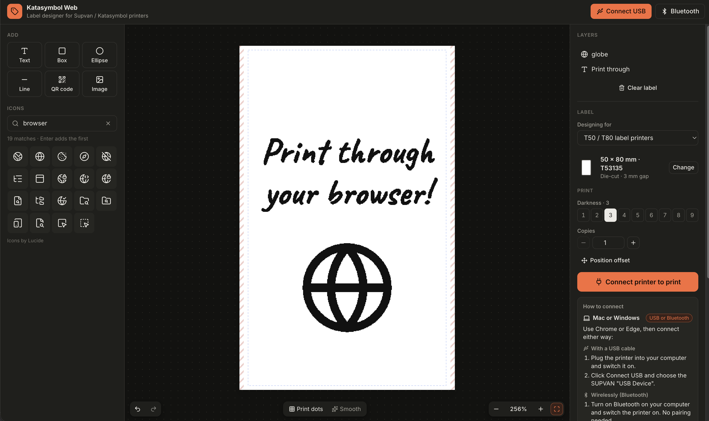
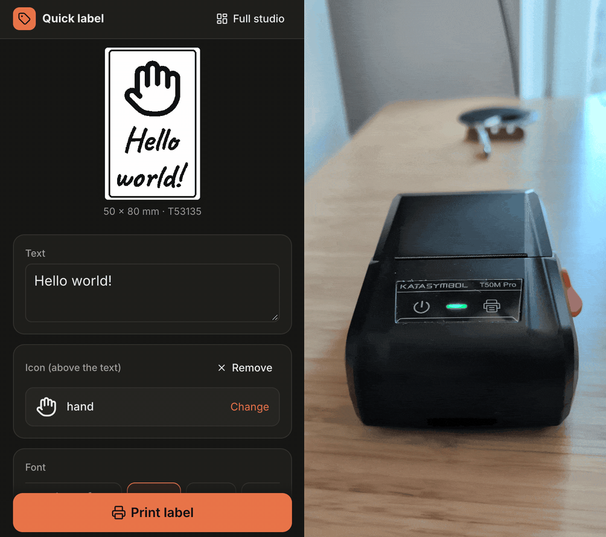

# Supvan & Katasymbol web print studio

**[Click here to open the app](https://khromov.github.io/supvan-katasymbol-printer-web-ui/)**

| Full studio                                                                                                                                                | Quick label (phone)                                                                                                                                                                      |
| ---------------------------------------------------------------------------------------------------------------------------------------------------------- | ---------------------------------------------------------------------------------------------------------------------------------------------------------------------------------------- |
|  |  |

Design and print labels on Katasymbol / Supvan label printers straight from the browser, over USB or Bluetooth.
A web replacement for the KatasymbolEditor desktop app: add text, icons (all ~1,850 Lucide icons,
searchable), QR codes, shapes and images, see exactly which dots will print, and print.

```sh
npm install
npm run dev        # http://localhost:5173, open in Chrome or Edge
npm run dev:lan    # HTTPS on the LAN (self-signed) for testing on a phone
```

Click **Connect printer** and pick the SUPVAN "USB Device". After the first time the app reconnects
automatically. The printer's loaded label is detected (T50/T80 and G series) and the design follows it.

## Connecting your printer

| Device        | Browser                                                                  | How to connect                                                                                                                                                         |
| ------------- | ------------------------------------------------------------------------ | ---------------------------------------------------------------------------------------------------------------------------------------------------------------------- |
| Mac / Windows | Chrome or Edge                                                           | **USB cable:** plug the printer in and click **Connect USB**.<br>**Wireless:** turn on Bluetooth, click **Bluetooth** and pick the printer (`T0…`). No pairing needed. |
| Android       | Chrome                                                                   | Turn on Bluetooth, tap **Bluetooth** and pick the printer (`T0…`).                                                                                                     |
| iPhone / iPad | [Bluefy](https://apps.apple.com/app/bluefy-web-ble-browser/id1492822055) | Safari can't connect to printers. Open the site in Bluefy, tap **Bluetooth** and pick the printer (`T0…`).                                                             |

The printer takes one connection at a time, so close the Katasymbol app on your other devices
first. USB only works on computers: Android Chrome has no WebHID, and iOS browsers have no USB
access at all.

### Install as an app

The site is an installable web app: in Chrome or Edge choose **Install app** (or **Add to Home
screen** on Android). Long-press the icon for **Quick label** and **Full studio** shortcuts. On iPhone
you can add it to the home screen too, but home-screen apps there can't use Bluetooth, so print from
Bluefy.

## Bluetooth (T50/T80 series)

The T50M Pro and its siblings also print wirelessly. Their Bluetooth chip is dual-mode, and the app
can use either side:

- **Bluetooth LE via Web Bluetooth** (default where available: desktop Chrome/Edge, Android Chrome,
  and **Bluefy on iPhone/iPad**, since Safari has no Web Bluetooth). No pairing needed: click
  **Bluetooth** and pick the printer (`T0…`). GATT service `0000e0ff-3c17-d293-8e48-14fe2e4da212`,
  write `ffe9`, notify `ffe1`. Verified printing from desktop Chrome on macOS and from Bluefy on iOS.
- **Classic Bluetooth (SPP) via Web Serial**, used when Web Bluetooth isn't available, or forced with
  `?bt=serial`. Pair the printer in the OS first. Verified from Android Chrome. On macOS it only works
  in the first session after pairing (later opens fail until the printer is re-paired).

Both carry the same `7E 5A` frames (ported from the Katasymbol Android app; see
`src/lib/printer/families/t5080-bt.ts` and `ble.ts`). Over LE the printer doesn't acknowledge data
frames. Add `?debug` to the URL to see a copyable protocol log.

## Browser support

The printers expose a vendor-defined **HID** interface (usage page `0xFF00`, 64-byte reports), so the
app uses **WebHID** rather than raw WebUSB. Chrome blocks WebUSB from claiming HID-class interfaces,
and the official Electron app uses `navigator.hid` too. WebHID is available in Chromium-based desktop
browsers (Chrome, Edge, Opera, Arc). Designing works everywhere; only printing needs WebHID.

## Supported printers

Every model KatasymbolEditor 1.1.1 knows about (`src/lib/printer/devices.ts`):

| Family             | Models                                                         | Status                                                                                                         |
| ------------------ | -------------------------------------------------------------- | -------------------------------------------------------------------------------------------------------------- |
| T50/T80 (`t5080`)  | T50M, T50M Plus, T50M Pro, T50S, T50i, T50 Max, T80M, T80M Pro | Encoder byte-identical to the official app; printed on a real T50M Pro (USB `1820:2076`)                       |
| SP (`sp`)          | SP650                                                          | Byte-identical encoder; not hardware-tested                                                                    |
| TP (`tp`, `tp86a`) | TP76i, TP80A, TP86A                                            | Byte-identical encoders and full-job report streams in simulation; not hardware-tested                         |
| G (`g`)            | G11 Pro, G15 Pro, G15 MPro, G18 Pro, G21, G25, G28             | Byte-identical at 203 dpi; 300 dpi (G25/G28) geometry is a best effort because the official code crashes there |

## How it works

- `src/lib/printer/`: protocol layer, independent of the UI.
  - `transport.ts`: 64-byte report transport (WebHID); `scripts/node-transport.ts` is a node-hid version for testing.
  - `channel.ts`: serialized request → response channel and the `C0 40 vh vl cmd 00 08 00` command framing.
  - `families/*.ts`: one driver per printer family. They port the official `*PrintUtils`/`*ImageEncodeUtils`
    state machines to linear async code: raster rotation/cropping, column packing, 4 KB buffers with
    checksums, Supvan's LZMA streams, and the check → start → transfer → buffer-full → wait sequence.
  - `lzma.js`: LZMA-JS as **modified by Supvan** (8 KB dictionary, no end marker). The firmware needs
    these exact settings, so don't replace it with stock LZMA-JS.
- `src/lib/design/`: the label document model and a canvas renderer. Text, icons, shapes and QR codes
  use the official 180 threshold; emoji are dithered (saturation-aware, outlined) so they keep their
  shading; images have their own threshold/dither controls.
- `src/lib/catalog/`: label catalogs extracted from the official app (`npm run catalog <app.js>`).

## Deployment

Every push to `main` builds and deploys to GitHub Pages via `.github/workflows/deploy.yml`
(Pages source: GitHub Actions). The build uses relative asset paths (`base: './'`), so it works under
the `/supvan-katasymbol-printer-web-ui/` subpath.

## Hardware scripts (Node, node-hid)

```sh
npm run probe        # read-only: status and loaded label
npm run print-test   # prints an orientation test pattern on the loaded label
```

## License

[MIT](LICENSE)
